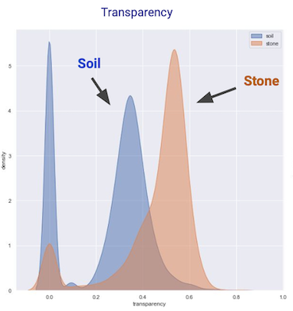
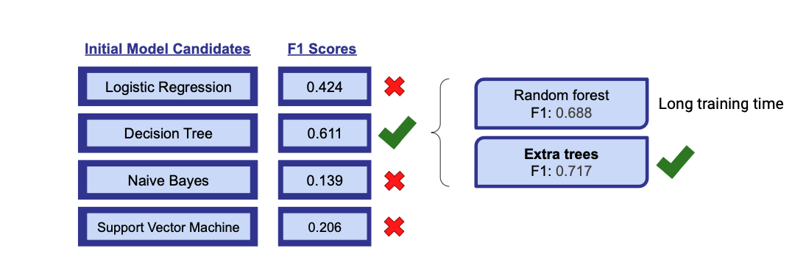
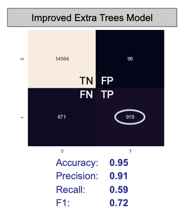

# Ancient Artifacts Project

- This project is a binary classification problem, using data from archaeological samples to distinguish between soil particles and stone microdebitage associated with ancient toolmaking sites.
- After comparing Naive Bayes, Logistic, SVM, and tree-based models, we selected ExtraTrees Classifier as our optimal model.
- This is a personal fork of an academic group project. Credit to Mubarak Ganiyu, Sydney Simmons, Shuyang Lin, and Weixi Chen for initial work.

# Background
The analysis of lithic microdebitage can illuminate ancient stone tool manufacturing practices to provide insight into past cultural activity. In his dissertation, Dr. Markus Eberl studied the small Mayan site of Nacimiento in the Petexbatun region of Guatemala to investigate how a substantial change in regional political power affected the inhabitants and the local community. One aspect of investigating the cultural dynamics in the region during the 7th and 8th centuries is to understand the the public structures and daily community interactions.

The purpose of this project is to identify the location of ancient stone tool manufacturing areas within this village. The locations of these manufacturing areas may be uncovered by analyzing the soil composition. Although ancient stoneknappers (people who made stone tools) often cleared large and sharp debris from their area of work, lithic microdebitage - that is, particles < 4mm or 1/6th of an inch - would be very difficult to remove from their workspace. Thus, evidence of lithic microdebitage in the soil can inform the location of these ancient stoneknapping sites and the methods used to create the stone tools. Soil samples from 50 locations within the village were collected for analysis.

Samples of microdebitage obtained from current stoneknappers provides a set of examplars to compare with the particles of the soil samples. In order to characterize these samples, a particle analyzer can be used, which provides 40 measurements about each particle contained within the sample. From this, the profiles of the soil samples can be computed to identify likely stoneknapping sites.

# Data
Data management is expected to be an challenge and a workflow should be established to enable expeditious usage of the data. Currently, there are 50 soil samples from the Mayan village of interest. The goal is to identify the composition of these soil samples, and the contained particles will be characterized by the PartAn 3D particle analyzer. The particle analyzer measures 40 variables for every particle, and there are approximately ~500,000 particles in every sample. The training data contains 30-50 collected and labelled microdebitage samples collected from modern stoneknappers, and represents the stages of specific work. The two data sources can be seen below:
- Archaeological Soil Data
- Lithic Experimental Data
